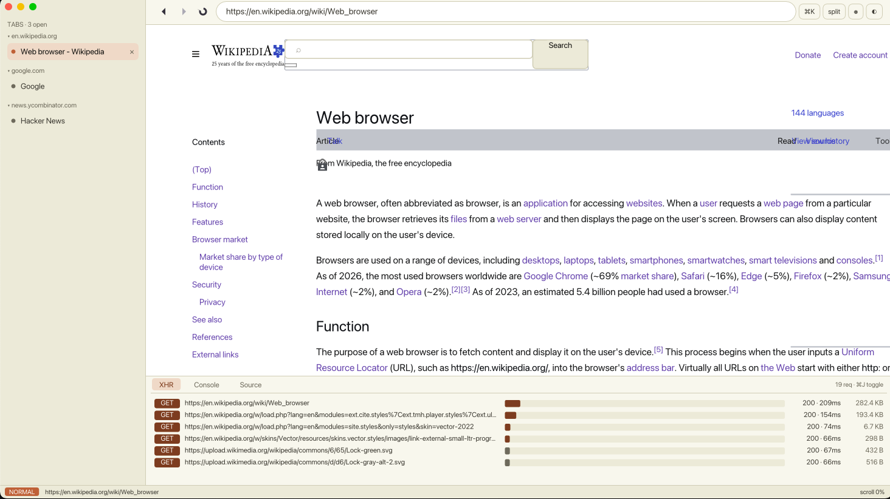

# Copper

A from-scratch Rust browser, hosted on the
[Zinc](https://github.com/florekio/Zinc) JavaScript engine.

> A hand-rolled HTML/CSS/layout/networking stack on top
> of a hand-rolled JS engine, no `html5ever`, no `cssparser`, no `taffy`, no
> `cosmic-text`, no `tiny-skia`. The only crates we lean on are the ones we
> *deliberately* don't want to write: `tokio`, `rustls`, `winit`, `wgpu`,
> `vello`. Everything between HTTP bytes and pixel quads is ours.

This is a hobby project. It is not a Chrome competitor. It is not a Firefox
competitor. It is the kind of thing you build because you want to know how
browsers actually work — top to bottom.



The shell is a developer-first chrome: a vertical sidebar with tabs grouped
by hostname, a slim URL bar, a permanent dev-dock at the bottom (XHR
waterfall, Console, raw HTML source — toggle with `⌘J`), and a status line.
[`docs/architecture.md`](docs/architecture.md) walks through the crate graph.

---

## Quick start

```bash
# Build (first build is slow — pulls wgpu/vello/tokio/rustls).
cargo build --release

# Open the window with placeholder chrome.
cargo run --release --bin copper

# Fetch a URL over real TLS and dump the body.
cargo run --release --bin copper -- https://example.com

# Same, but parse the response and dump the DOM tree.
cargo run --release --bin copper -- --parse https://example.com

# Open the window and render a real page.
cargo run --release --bin copper -- render https://example.com
```

Run the test suite:

```bash
cargo test --workspace
# 76 tests across 14 crates.
```

---

## Architecture

Copper is a Cargo workspace of focused crates. The dependency graph flows
strictly bottom-up — HTTP and URL at the base, integration (DOM ↔ JS,
event loop) at the top. Every crate is independently testable.

```
copper (binary)
  ├── bui-shell          winit window + event loop
  │     └── bui-gpu      wgpu + vello compositor (intermediate texture + blit)
  │           └── bui-paint    renderer-agnostic display list
  ├── bui-layout         block + inline layout, minimal flexbox
  │     ├── bui-style    cascade, computed values, UA stylesheet
  │     │     └── bui-css      tokenizer, parser, selectors L4 subset
  │     └── bui-paint
  ├── bui-html           HTML5 tokenizer + tree builder
  │     └── bui-dom      arena-allocated DOM tree
  ├── bui-js             Zinc integration (script eval, DOM events)
  │     ├── bui-dom
  │     └── zinc         (the JS engine, https://github.com/florekio/Zinc)
  ├── bui-net            HTTP/1.1 over rustls + tokio, cookie jar
  │     └── bui-url      WHATWG URL parser
  ├── bui-text           Unicode segmentation, BiDi, OpenType, glyph raster
  └── bui-image          PNG / JPEG / GIF decoders
```

### What's in each crate

| Crate | Purpose | Phase |
|---|---|---|
| `bui-url` | WHATWG-shaped URL parser. http(s) only, IPv6 literal hosts allowed, percent-encoding/IDNA deferred. `Url::join` for relative resolution. | 1 |
| `bui-net` | Hand-rolled HTTP/1.1 (request serializer + response parser, `Content-Length` and chunked framing, header continuation, redirects). TLS via `rustls` + `tokio-rustls` with the `ring` provider and `webpki-roots`. RFC 6265 cookie jar with domain/path matching, Secure, Max-Age, Expires. | 1, 10 |
| `bui-dom` | Arena-allocated DOM tree. `NodeId(u32)` indices, parent/sibling/child pointers, traversal helpers, pretty-printer. | 2 |
| `bui-html` | HTML5 tokenizer state machine (~30 states, all four attribute-quoting flavors, raw-text for script/style/textarea/title, named + numeric character references) + pragmatic tree builder (implicit-close rules for p/li/dt/dd/tr/td/th/option, void elements, no foreign content / formatting-element adoption / foster parenting yet). | 2 |
| `bui-css` | CSS Syntax Level 3 parser (style rules + at-rules kept opaque). Selectors Level 4 subset: type / universal / id / class / attribute (`=`, `~=`, `\|=`, `^=`, `$=`, `*=`) / `:hover`, `:link`, `:first-child`, `:last-child`, `:nth-child(an+b)`, `:not(...)` / descendant, child, adjacent-sibling, general-sibling combinators. Specificity per spec. | 3 |
| `bui-style` | Selector matching against the DOM, cascade with origin + `!important` + specificity + source-order priority, inheritance, inline `style="..."` attribute, and a built-in user-agent stylesheet (`src/ua.css`). Produces a `ComputedValues` per element. | 3 |
| `bui-layout` | Box tree from styled DOM. Block formatting context (vertical stack, full-width children, margin/padding/border resolved). Inline formatting context with word-wrap using a monospace metric. Minimal flexbox row (equal-share children). Emits a `DisplayList`. | 4, 7 |
| `bui-paint` | Display-list types (`Color`, `Rect`, `PaintCommand::FillRect` and `PaintCommand::Text`). | 0, 4 |
| `bui-gpu` | wgpu + vello compositor. Renders into an `Rgba8Unorm` storage texture (vello's compute kernels need this) and blits to the window surface using `wgpu::util::TextureBlitter`. Text commands draw a faint band + per-character strokes — placeholders until real glyphs land in Phase 6. | 0, 4 |
| `bui-shell` | `winit::ApplicationHandler` that owns the compositor and pumps events. Entry point: `App::new(scene_fn).run()`. | 0 |
| `bui-js` | Inline `<script>` evaluation through Zinc's `Engine::eval_with_output`. Real DOM event dispatch (capture/target/bubble + `stopPropagation`), waiting on a Zinc patch to expose listeners to JS. | 5, 9 |
| `bui-text` | API + monospace metric fallback. OpenType parsing, BiDi, Bézier rasterizer, glyph atlas: deferred (the multi-month item the design called out). | 6 |
| `bui-image` | Hand-rolled Deflate (RFC 1951: stored, fixed, dynamic Huffman, LZ77 back-references) and PNG decoder (signature + chunk parser, IHDR, IDAT, defilter None/Sub/Up/Average/Paeth, RGBA8 expansion from grayscale / grayscale+α / RGB / RGBA / palette, `tRNS` honored). 8-bit non-interlaced only — Adam7 + 16-bit are pipeline-ready. JPEG/GIF/WebP still deferred. | 8 |
| `bui` | The binary that ties it all together. Crate is published as `bui`, binary is `copper`. | — |

---

## Phase status

The original implementation plan was twelve phases. Honest tally of what's
in this repo today:

| Phase | Description | Status |
|---|---|---|
| 0 | Workspace + winit + wgpu + vello window | ✅ real |
| 1 | URL parser + HTTP/1.1 + TLS | ✅ real (verified live against example.com + github.com) |
| 2 | HTML tokenizer + tree builder | ✅ pragmatic subset (no formatting-element adoption, no foster parenting, no foreign content) |
| 3 | CSS parser + selectors + cascade | ✅ pragmatic subset |
| 4 | Block + inline layout | ✅ block stacking + word-wrap rendered live on example.com |
| 5 | Zinc integration | ⚠️ inline `<script>` eval works; real DOM bindings need a Zinc patch (see *Next steps*) |
| 6 | Real text shaping | ⚠️ skeleton only — OpenType + Bézier raster + BiDi is honestly multi-month work |
| 7 | Flexbox | ⚠️ minimal row layout (equal-share children); `flex-grow`/`shrink`/`basis`/`justify-content`/`align-items` deferred |
| 8 | Image decoders | ✅ real PNG (with hand-rolled Deflate); JPEG/GIF/WebP still deferred |
| 9 | DOM events | ⚠️ real Rust-side dispatch + tests; needs the Phase 5 Zinc patch to fire from JS |
| 10 | Cookies + storage | ✅ real RFC 6265 cookie jar; `localStorage` deferred |
| 11 | CSS Grid | ⏭ skipped (optional in plan) |
| 12 | HTTP/2 | ⏭ skipped (optional in plan) |

End-to-end pipeline shipping in the binary today:

```
TCP (tokio) → TLS (rustls) → HTTP/1.1 parse (bui-net)
            → HTML5 parse (bui-html → bui-dom)
            → CSS extract + cascade (bui-css → bui-style)
            → box tree + layout (bui-layout)
            → display list (bui-paint)
            → vello compute → wgpu blit → window (bui-gpu, bui-shell)
```

Test count: 86 across the workspace, all green.

---

## Deliberately deferred work

These are the lines we drew that don't say "we ran out of time" — they say
"this is a separate kind of project from a browser":

- **TLS** (`rustls`). Hand-rolling cryptography is a different project; one
  bug means silent data leaks.
- **Async runtime** (`tokio`). Writing your own epoll/kqueue/IOCP layer is a
  year of orthogonal work.
- **Window + GPU surface** (`winit`, `wgpu`). The platform layer isn't the
  fun part to write yourself.
- **Compute shaders for 2D** (`vello`). We hand-roll the display-list
  *commands*, but the GPU pipeline that consumes them is `vello`'s job.

Hand-rolled, on the other hand: HTML parser, CSS parser, selectors, cascade,
DOM, layout, line breaking, HTTP/1.1, cookie store, event dispatch.

---

## Next steps (in priority order)

The single highest-leverage change: a focused patch to **Zinc** that
unblocks both Phase 5 (DOM bindings) and Phase 9 (`addEventListener` from
JS). Roughly:

1. In `runtime/object.rs`, add an `ObjectKind::Host { tag: HostTag, payload: u32 }` variant so foreign-data can ride on a `JsObject`.
2. In `vm/vm.rs:3022`, dispatch `FunctionKind::Native { func, .. }` (the variant exists in `runtime/object.rs:165` but is never called today — the VM only dispatches `NativeSentinel`).
3. In `engine.rs`, expose `Engine::register_native_function(name, NativeFn)` and persist the `Vm`'s globals across `eval` calls so each `<script>` tag sees the bindings the previous script left.
4. Add a GC-sweep callback so `bui-js` can drop dead `(ObjectId → NodeId)` table entries without leaking.

Once that lands, `bui-js` already has the type-tagged `EventListenerMap`
machinery and the `execute_inline_scripts` walk waiting to plug in.

After that, in approximate order of usefulness for hobby browsing:

5. **Real text** — hand-rolled OpenType (`cmap` format 4, `head`, `hhea`, `hmtx`, `glyf` simple-glyph), cubic Bézier flattening, scanline rasterizer, GPU glyph atlas. Latin-only is fine.
6. **`` integration** — `bui-image` now decodes PNGs end-to-end; the missing piece is wiring image elements through `bui-style`/`bui-layout` so they take part in line breaking and contribute to box height, then handing the decoded pixels to `bui-gpu` as a textured rect.
7. **Real flexbox** — `flex-grow` / `flex-shrink` / `flex-basis`, `justify-content`, `align-items`, `flex-wrap`. Once images and text land, modern sites need this to be readable.
8. **Connection pooling** — the current `Connection: close` model means every fetch is a fresh TLS handshake. Keep-alive will make navigation feel responsive.
9. **`document.cookie` and `localStorage`** — the cookie jar is in place; just needs the JS surface.

The original plan (`/Users/florianstein/.claude/plans/i-would-like-to-cached-sifakis.md`) remains the source of truth for the long-form roadmap.

---

## Toolchain

- Rust 1.94+ (Edition 2024)
- macOS (verified) and Linux (untested but should work — wgpu picks Vulkan).
  Windows requires a `winit-x11`/`winit-wayland`-free build, which we don't
  currently configure.

Crates pinned to:

| Dep | Version | Why |
|---|---|---|
| `winit` | 0.30 | `ApplicationHandler` API; 0.31 is beta |
| `wgpu` | 28 | matches `vello = 0.8`'s required range |
| `vello` | 0.8 | latest stable; uses `peniko` 0.6 + `kurbo` 0.13 |
| `tokio` | 1 | net + io-util features only |
| `rustls` | 0.23 | `ring` provider, no `aws-lc-rs` |
| `tokio-rustls` | 0.26 | matches `rustls` 0.23 |
| `webpki-roots` | 1 | Mozilla CA bundle |
| `thiserror` | 2 | error derivation |

---

## Documentation

Long-form docs in [`docs/`](docs/):

- [`architecture.md`](docs/architecture.md) — crate graph + the full HTTP-bytes-to-pixels pipeline.
- [`keybindings.md`](docs/keybindings.md) — shortcut cheat sheet.
- [`dev-dock.md`](docs/dev-dock.md) — XHR / Console / Source dev-dock.
- [`contributing.md`](docs/contributing.md) — setup, code style, how to add a CSS property or a chrome surface.

---

## License

MIT, see [LICENSE](LICENSE).
